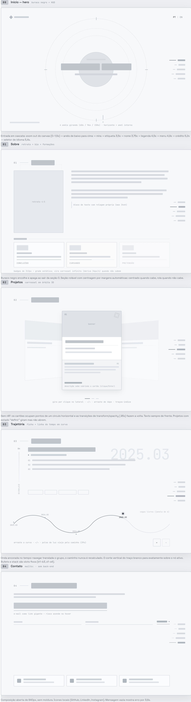

<pre>
~/

█▀█ █▀█ █▀▄ ▀█▀ █▀▀ █▀█ █   █ █▀█
█▀▀ █ █ █▀▄  █  █▀▀ █ █ █   █ █ █
▀   ▀▀▀ ▀ ▀  ▀  ▀   ▀▀▀ ▀▀▀ ▀ ▀▀▀
by Catmaitachi
</pre>

   

## Ideia principal

O portifólio é uma SPA com temática espacial, ele contem sessões de informações sobre mim, meus projetos, trajetória/experiência profissional e contato.

A ideia é que o portifólio seja uma experiência visualmente rica, com animações e interações que o tornam exclusivo e estiloso mas sem perder a simplicidade e a clareza de navegação.

## Wireframes

## Documentação

* [Requisitos](./docs/requisitos.md) — requisitos funcionais e não funcionais.
